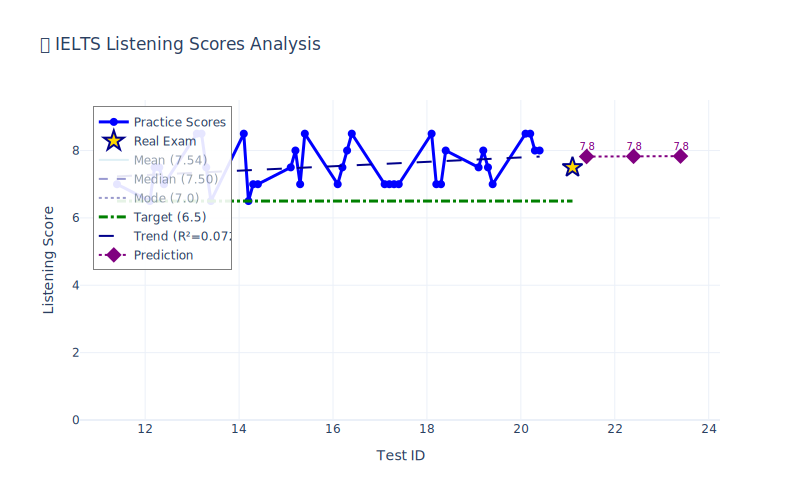
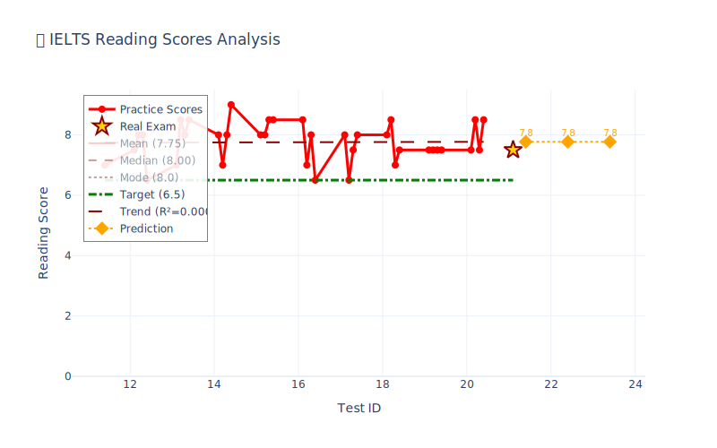

# IELTS Tools

> - 一些雅思学习工具，包括单词、听力、阅读、写作、考场分析
> - As a Chinese developer, I initially created this tool specifically for Chinese students preparing for the IELTS. 
> - However, its structure is highly flexible, making it very easy to adapt or migrate to support learners of other languages if needed.

#### 📊 My Score

<div align="center">
  
  
</div>


#### Setup
安装听写基本环境（听写语音包、google翻译）
```shell
conda env create -f env.yml
```
安装扩展环境（基本环境，以及音标生成、语法检查、某社交媒体app评论抓取）
```shell
conda env create -f env_ext.yml
```

---
#### Getting Start

##### 📝 单词管理工具
- **ielts_vocab_radom.py**
    - 用于打乱单词顺序
- **ielts_vocab_from_text.py**
    - 用于从文本提取单词
- **ielts_vocab_from_print.py**
    - 从打印材料或图片中提取单词
- **ielts_vocab_same.py**
    - 检查和合并重复单词

##### 🎧 听力练习工具
- **ielts_vocab_online_voice_to_en.py**
    - 读英文，听写单词，用于提升Listening
    - 拼写完给出中文
- **ielts_vocab_online_speaking_test.py**
    - 语音听写测试，带计时器功能
    - 支持音频重播和实时计时

##### ✍️ 写作练习工具
- **ielts_vocab_online_cn_to_en.py**
    - 给出中文，听写单词，用于提升Writing
    - 统计正确率和错题表
    - 支持翻译缓存，提升练习效率
- **ielts_vocab_to_sentence.py**
    - 单词造句练习工具
    - 集成LanguageTool语法检查

##### 📖 阅读练习工具
- **ielts_vocab_online_en_to_cn.py**
    - 给出英文，判断是否认识，用于提升Reading
    - 统计正确率和错题表

##### 📄 文档生成工具
- **ielts_gen_vocab_md_tts.py**
    - 生成tts input，在[这个网站](https://ttsreader.com/player/)用于tts听写
    - 生成单词表markdown table，用于背诵
    - 可更改生成文件名称，以及md列数
    - md可以通过这个[extension](https://marketplace.visualstudio.com/items?itemName=shd101wyy.markdown-preview-enhanced)转pdf或html
- **ielts_gen_vocab_and_phonetic_md.py**
    - 生成单词表markdown table，用于背诵
    - 包含音标（使用CMU字典转IPA音标）
- **ielts_gen_chunk_md.py**
    - 生成写作短语/句块的markdown文档
- **ielts_gen_chunk_mds.py**
    - 批量生成多个写作段落的markdown文档
    - 支持Task1/Task2不同段落分类
- **ielts_gen_writing_md.py**
    - 生成写作模板和范文的markdown文档

##### 🌐 网络数据工具
- **ielts_red_note_comments.py**
    - 手动复制网页前端body到temp.html
    - 从某社交软件抓评论，整理到markdown
    - 给大模型归纳评价（手动）
