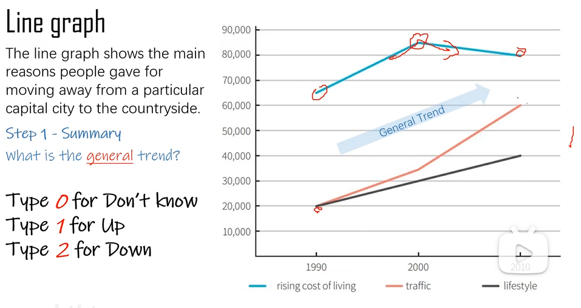

# Writing Task 1

> https://space.bilibili.com/396671281/lists/4344993?type=season

---

- [x] ⭐ Dynamic charts
- [ ] ⭐ Static charts
- [ ] ⭐ Mixed charts
- [ ] ⭐ Map
- [ ] ⭐ Flow charts

### Dynamic charts

    

The line graph demonstrates the main motivations people expressed for relocating to the countryside from the urban area of a capital city in 1990, 2000 and 2010.
The years witnessed a large number of people moving away for different reasons.

According to the graph, the major reason is rising cost of living. In 1990, 65,000 people left the city because of this. Then the number peaked at 85,000 in 2000, followed by a going down to 80,000 from 2000 to 2010.

The situations were slightly different on traffic and lifestyle.
The numbers of city leavers in these 2 groups started from a same point in 1990 at 20,000, much lower than that of rising cost of living.
Althouph both of them saw a rising over this period, they increased in different rates.

People who moved away to change a lifestye climbed in a steady rate.
In 2000 and 2010, the figure arrived 30,000 and 40,000 respectively.
Others who relocated according to the traffic reached a figure of 35,000 in 2000, followed by an obvious increasement of speed. Finally, the number came to 60,000 in 2010.

### Static charts

根据数字、比例分类

### Mixed charts

// intro

bar chart shows ralation between income to expendiuture on fast food.

line chart shows consumption of 3 fast food in 1970-1990

// number 2
in general, more on hamburgers than ..
in detail, high point 
// trend 2
as in come go down, ham and pizza go down, fellll to 15 and 7.
meanwile, fish and chops remain steady, around 20

//overall trend 2
from 1970 to 1990, pizza and ham rise, fish follow differnt trend.

// details 4 
at 1970, fish is hights in
but kepted falling to .. until 1985, followed by a slightly rising to ...  

by contrast, ham and pizza start at ... at 1970, but rize to
the rising rate of ham is kind of higher than pizza

### Map
- 两个地图之间的变化

- 大变化
- 小变化

- remain:
- move:
- new:
- change：

### Flow charts

基础：action
details：steps，purpose，relation，shape，size

